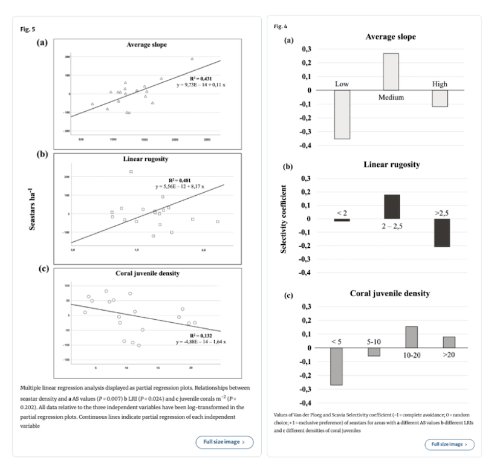

# Set Up

```{r}
#| label: Set Up
#| message: false
library(tidyverse)
library(here)
library(janitor)
library(readxl)
library(ggeffects)
salinity <- read_csv(
  here(
    "data",
    "salinity-pickleweed.csv"
  ))
my_data <- read_csv(
  here(
    "data",
    "my_data Sheet2.csv"
  ))
```

[html link](https://samarx27.github.io/ENVS-193DS_homework-03/)

# Problem 1. Slough Soil Salinity

## a.

A Pearson's correlation test would determine the strength of the relationship between salinity and California pickleweed biomass because this type of correlation is meant for continuous variables. However, this also needs the data to be normally distributed. Alternatively, the strength of the relationship could be tested through a Spearman's rank correlation, which measures the strength and direction of the relationship between the variables and is usually used for non-parametric variables.

## b.
```{r}
ggplot(data = salinity, 
       aes(x = salinity_mS_cm, 
           y = pickleweed)) +
  geom_point(color = "red") +
  labs(x = "Salinity (mS/cm)", 
       y = "Pickleweed Biomass (g)") +
theme_minimal()
```

## c.

```{r}
ggplot(data = salinity, 
       aes(sample = salinity$salinity_mS_cm)) +
  geom_qq() +
  geom_qq_line() +
theme_minimal()
```

```{r}
ggplot(data = salinity, 
       aes(sample = salinity$pickleweed)) +
  geom_qq() +
  geom_qq_line() +
theme_minimal()
```

```{r}
cor.test(salinity$salinity_mS_cm, salinity$pickleweed, 
         method = "pearson")
```
In the plot in 1b, the linear relationship between the two variables is tested and determined to exist. I used QQ plots for each column to test the normality condition, which was concluded to be normal. In the correlation test above, which is a Pearson Correlation test, the strength of this relationship is tested and is determined to be of moderate strength (Pearson's r = 0.53, t(21) = 2.90, p = 0.009, $\alpha$ = 0.05). 

## d. 
To evaluate the assumption that the predictor variable (salinity) does not predict the response variable (pickleweed), I used a scatter plot, which indicated that there may be a positive relationship between the variables. To evaluate the strength of the relationship between pickleweed biomass and soil salinity, I used Pearson's Correlation test, which resulted in the variables having moderate strength relationship between the variables (Pearson's r = 0.53, t(21) = 2.90, p = 0.009, $\alpha$ = 0.05). 

## e.

Based on the data, pickleweed biomass in grams and salinity (mS/cm) have a positive relationship, meaning that, with higher salinity, there will be more biomass of pickleweed. This indicates that there will be a higher planting success at a site with higher salinity, though the strength of this relationship is only moderate. 

## f.

```{r}
cor.test(salinity$salinity_mS_cm, salinity$pickleweed, 
         method = "spearman")
```
Both tests would have led me to make the same decision (rejecting the null hypothesis) because the correlation coefficients are similar values and indicate a moderate relationship. 

# Problem 2. Personal Data

## a.

```{r}
#| label: Jitter Plot displaying wake up time for school and non school days
my_data_clean <- my_data |> #labeling new data frame
clean_names() #cleaned names to only include lower case letters and underscores
ggplot(data = my_data_clean, #using my_data_clean data frame
aes(x = school_day_yes_no, #placing school_day_yes_no on the x-axis
y = wake_up_time_hrs_min, #placing wake_up_time_hrs_min on the y-axis
color = school_day_yes_no)) + #color by school_day_yes_no
geom_boxplot() + #creating a boxplot
labs(x = "School Day", #labeling the x-axis as School Day
y = "Wake Up time (hrs:min)", #labeling the y-axis as Wake Up time (hrs:min)
title = "Wake Up Time for School Days vs Non-School Days", #creating title
subtitle = "03/01/2026") + #creating subtitle
geom_jitter() + #creating jittered points
theme_light() + #changing theme to light
scale_color_manual(values = c("yes" = "blue4",
"no" = "red4")) + #changing colors based on whether or not it is a school day
theme(legend.position = "none") #removing the legend
```

```{r}
#| label: Time series plot for wake up time for each day
ggplot(data = my_data_clean, #determining data frame
aes(x = date, #placing these observations on the x-axis
y = wake_up_time_hrs_min)) + #placing these observations on the x-axis
geom_point(color = "gold") + #making the points gold
labs(x = "Date", #labeling the x-axis
y = "Wake Up time (hrs:min)", #labeling the y-axis
title = "Wake Up Time for Each Day", #creating a title
subtitle = "03/01/2026") + #creating a subtitle
theme_light() #changing the theme to light
```

## b.

Figure 1. This figure shows the distribution of recorded wake up times between school days, which is denoted by the blue points, and non-school days, which is denoted by the red points. Additionally, the figure shows the medians and quartiles for each type of day, represented by the boxes and lines, indicating that the median wake up time is later on non-school days than on school days.

Figure 2. This figure shows the distribution of recorded wake up times for each day from 01/25/2026 to 03/01/2026, denoted by the gold points.

# Problem 3. Affective Visualization

## a.

I think an affective visualization could look be similar to figure two, where instead of the points and axis, it could look like a sunrise where each point is supposed to fall, given that the data is showing when I wake up.

## b.

## c.

## d.

## e.

# Problem 4. Statistical Critique

## a.

The test in this paper is a one-way ANOVA test, though it also includes multiple regressions, linear regressions, and pearson correlations. Seastar abundance was the response variable and the predictor variables were the linear rugosity, coral juvenile density, and average slope.



## b. 

I would say the authors did well in representing their statistics in figures. The figures adequately represent the linear regression and selectivity coefficients, as the x- and y- axes are in logical positions and the figures do show the underlying data in their model predictions. However, these figures do not include summary statistics. 

## c.
I would say there is minimal "visual clutter" overall. I think the data to ink ratio is relatively high, as there are few elements that aren't directly displaying the data. 

## d.

The authors could add more information to the caption, which would make the figures more digestible and bring clarity to the point of the figure. For figure 5, it might be beneficial to make the axes tick labels clearer. 
